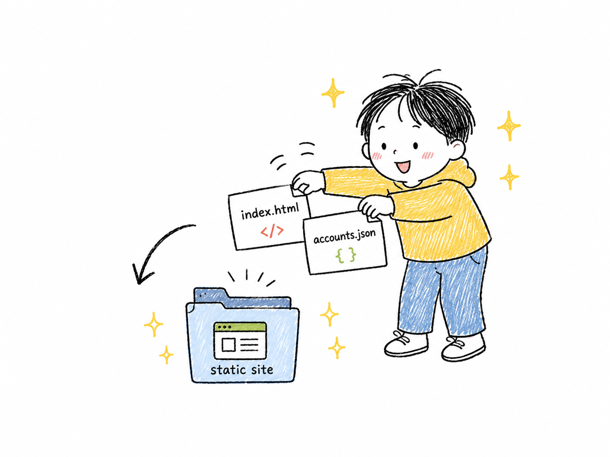
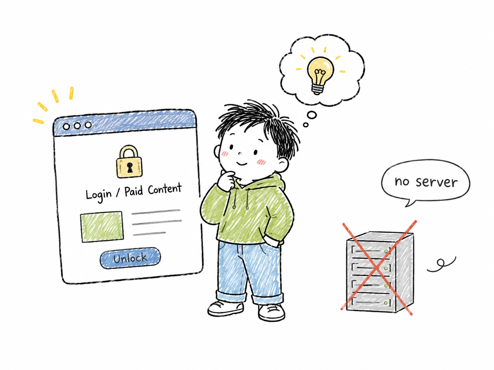

# html-account-admin · Zero-Backend Account Admin for Static HTML

> Purpose: explain what html-account-admin does, how to install it, and how to integrate it into a static HTML project. Target readers: developers and indie creators who want accounts, member-only pages, or a lightweight paywall for a single-file/static site. How to read: start with the comic overview and the fit/non-fit notes, then follow the install and integration sections.

English | [中文](./README.md)



`html-account-admin` is an account-management pattern for **pure static HTML projects**: one `account-admin.html` admin tool plus one repo-root `accounts.json` file. It works on Render, Cloudflare Pages, Vercel, GitHub Pages, EdgeOne Pages, and similar static hosts.

The point is simple: **you do not need to run your own backend**.

## What It Does



Use it when you want to:

- Add member login to a single-file HTML tool
- Add teaser/member-only content to a static site
- Add a lightweight paywall to a course, resource library, game, or knowledge graph
- Generate accounts locally with an admin page, then deploy `accounts.json` through git
- Validate a commercial idea before maintaining a database, server, or identity provider

Core features:

- **Account storage**: accounts live in `accounts.json` and deploy with the static site
- **Login check**: the main page fetches `accounts.json` and verifies password hashes in the browser
- **Member-state sync**: `BroadcastChannel + localStorage` keeps multiple tabs in sync
- **Admin tool**: a single-file `account-admin.html` with batch, auto-generate, verify, and parse flows
- **Static-host friendly**: works well with Render Static Site, Cloudflare Pages, Vercel, GitHub Pages, and EdgeOne Pages

## Important Honesty Notice


**This is a paywall, not real authentication.**

Anyone who knows browser dev tools may bypass it by changing `localStorage` or reading front-end code. Use it to keep casual visitors away from paid content. Do not use it to protect secrets, private data, financial data, or enterprise permissions.

Do not use this pattern if:

- You already have a real backend
- You need OIDC / SSO / Auth0 / Supabase / Clerk / Firebase
- You need audit logs, server-side revocation, or strict device control
- You need to protect content that must never be exposed

Those cases need a standard backend auth system or a professional identity provider.

## How It Works


The basic flow:

1. The admin opens `account-admin.html`
2. The admin generates account/password pairs
3. The admin exports or copies `accounts.json`
4. `accounts.json` is placed at the static site root
5. The main HTML page loads that account file
6. The user enters username and password
7. The browser re-hashes and verifies the password locally
8. Member content is unlocked after a successful check

A typical project looks like this:

```text
my-static-site/
├── index.html
├── account-admin.html
├── accounts.json
└── assets/
```

## Admin Tool


`templates/account-admin.html` is a single-file admin page you can copy into the target project. It includes these tabs:

- **Batch**: paste a batch of accounts and generate JSON
- **Auto**: generate account/password pairs automatically
- **Verify**: validate an account JSON file
- **Parse**: parse plaintext account lists and re-hash passwords

It is meant for the site owner/admin, not for public visitors.

## Hosting Options


This pattern works on any host that can serve static files:

- Render Static Site
- Cloudflare Pages
- Vercel
- GitHub Pages
- Tencent EdgeOne Pages
- Netlify
- Any Nginx / Apache static directory

As long as your main page can read same-origin `accounts.json`, it can work.

## How to Invoke the Claude Code Skill

After installation, you can ask Claude Code things like:

```text
add login to my static HTML
paywall for static HTML
I need accounts on my single-file site
add a member login to PoemGraph/WhiteBoard
给这个静态 HTML 加账号
给 index.html 加 paywall
```

You can also call it explicitly:

```text
/html-account-admin add login to my static HTML
/html-account-admin 给 WhiteBoard 加账号管理
```

## Install

Copy the whole repository into Claude Code's user-level skills directory:

```bash
mkdir -p ~/.claude/skills/html-account-admin
cp -r ./html-account-admin/* ~/.claude/skills/html-account-admin/
ls ~/.claude/skills/html-account-admin/
```

You should see:

```text
SKILL.md
INTEGRATION.md
CHANGELOG.md
templates/
```

Make sure `SKILL.md` keeps this frontmatter flag:

```yaml
user-invocable: true
```

Otherwise `/html-account-admin` may not respond as an explicit command.

## Integrate Into Your Project

See [INTEGRATION.md](./INTEGRATION.md) for the full guide. Short version:

1. Copy `templates/account-admin.html` to the target project root
2. Create `accounts.json.example`
3. Add the real `accounts.json` to `.gitignore` if you keep local working copies
4. Add account config meta tags to your main HTML `<head>`
5. Add the login functions and PRO bootstrap near the top of the main HTML
6. Wire `BroadcastChannel + storage` synchronization
7. Choose soft-lock or hard-gate behavior for member content
8. Deploy and verify that the page can read `accounts.json`

## File Structure

```text
html-account-admin/
├── README.md
├── README.en.md
├── SKILL.md
├── INTEGRATION.md
├── CHANGELOG.md
├── assets/
│   └── readme/
│       ├── admin-batch-tool.png
│       ├── member-login-flow.png
│       ├── no-server-paywall.png
│       ├── static-hosting-options.png
│       ├── static-site-files.png
│       └── teaser-to-member.png
└── templates/
    ├── account-admin.html
    └── accounts.json.example
```

## About GitHub README Tabs

GitHub Markdown does **not** support real tab controls inside README files. The reliable pattern is to keep separate files:

- [Chinese README](./README.md)
- [English README](./README.en.md)

You can use HTML `<details>` for collapsible sections, but it is not a real tab UI and is less clear than separate language files.

## Who Uses It

- **PoemGraph**: the source project where this account-admin pattern was first proven.

## License

MIT. You may copy, modify, and redistribute it. Please keep the PoemGraph attribution.

## Change Log

| Date | Change |
|------|--------|
| 2026-07-13 | Split the mixed bilingual README into separate Chinese and English files, and added six comic illustrations for a clearer GitHub landing page. |
| 2026-07-13 | Initial v1.0.0 release: extracted the reusable skill from PoemGraph `account-admin.html`. |
